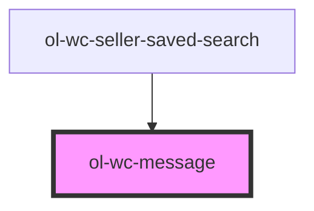

# ol-wc-message

<!-- Auto Generated Below -->

## Properties

| Property         | Attribute         | Description | Type                      | Default     |
| ---------------- | ----------------- | ----------- | ------------------------- | ----------- |
| `args`           | --                |             | `string[]`                | `undefined` |
| `defaultMessage` | `default-message` |             | `string`                  | `undefined` |
| `languageCode`   | `language-code`   |             | `string`                  | `undefined` |
| `message`        | `message`         |             | `string`                  | `undefined` |
| `messageKey`     | `message-key`     |             | `string`                  | `undefined` |
| `model`          | --                |             | `{ [key: string]: any; }` | `undefined` |
| `plId`           | `pl-id`           |             | `number`                  | `undefined` |

## Dependencies

### Used by

 - [ol-wc-seller-saved-search](../seller-saved-search)

### Graph

----------------------------------------------

*Built with [StencilJS](https://stenciljs.com/)*
